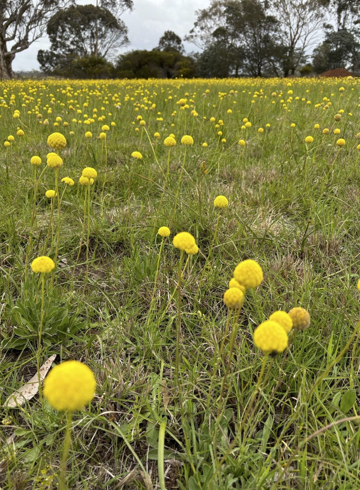
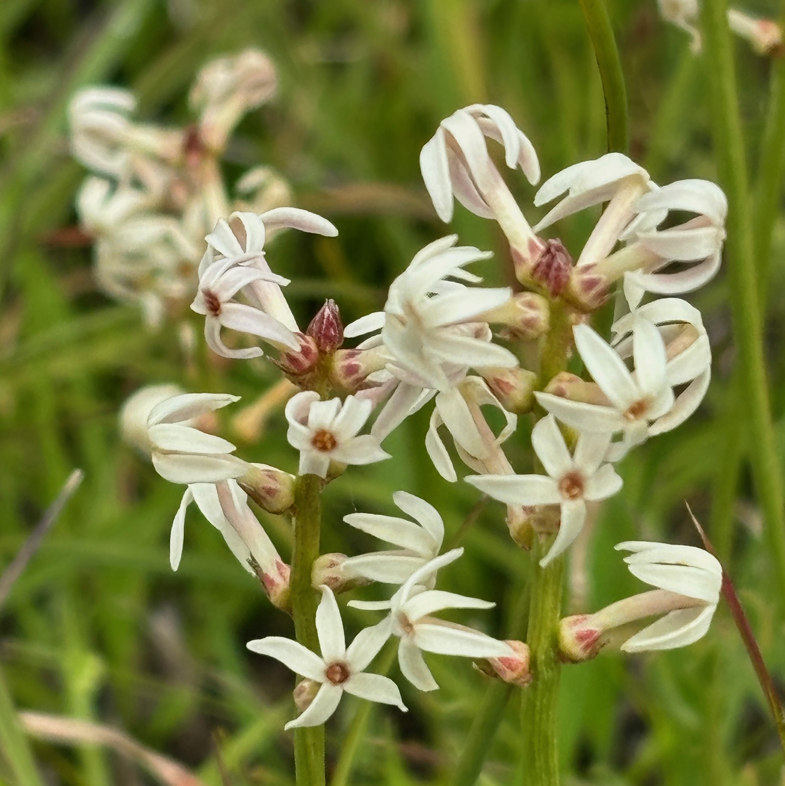
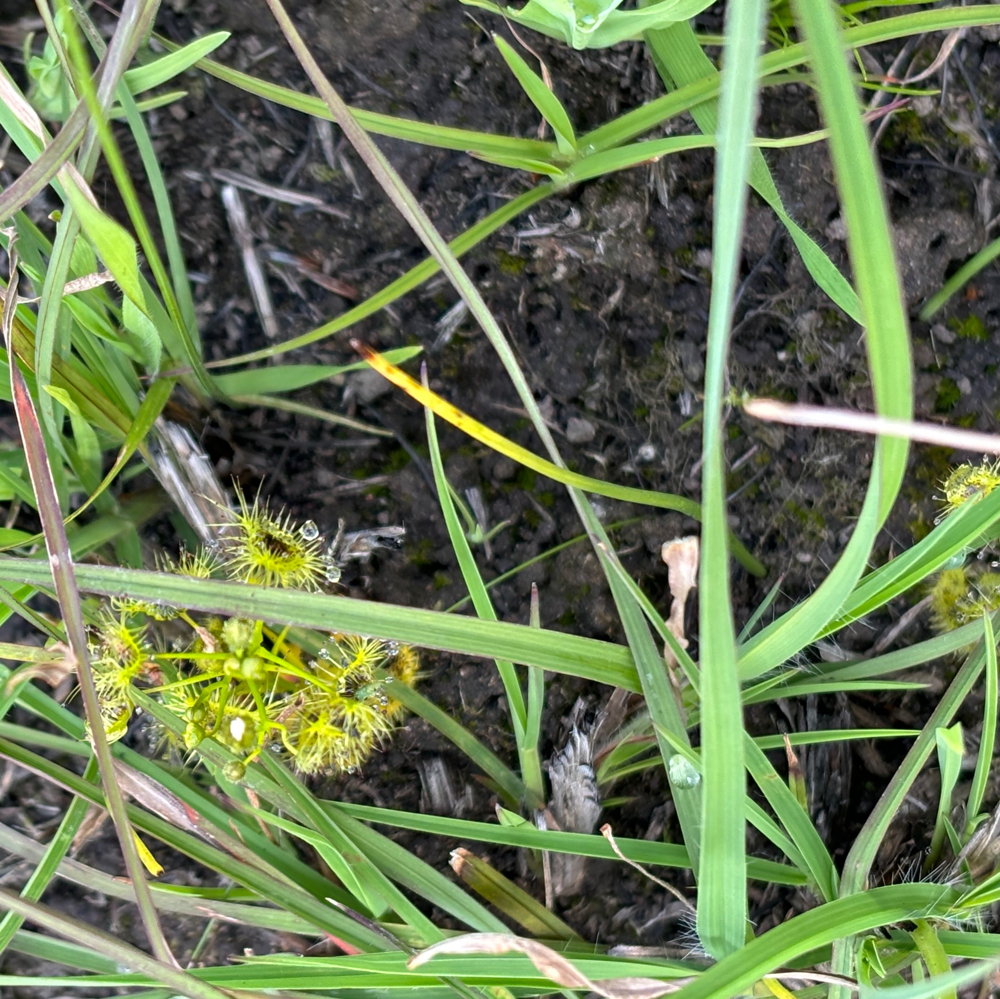
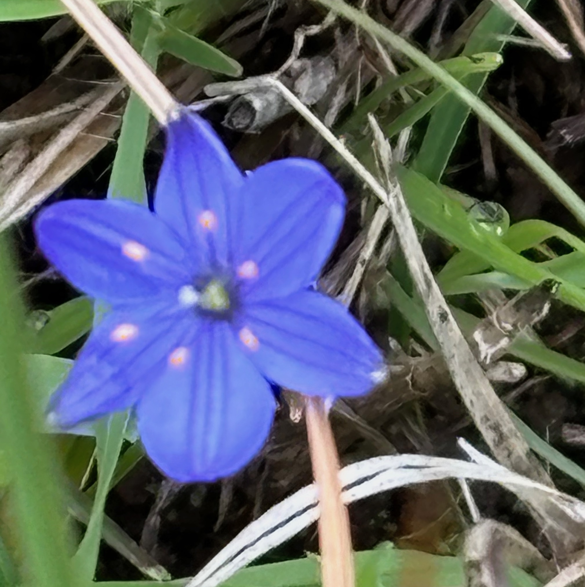
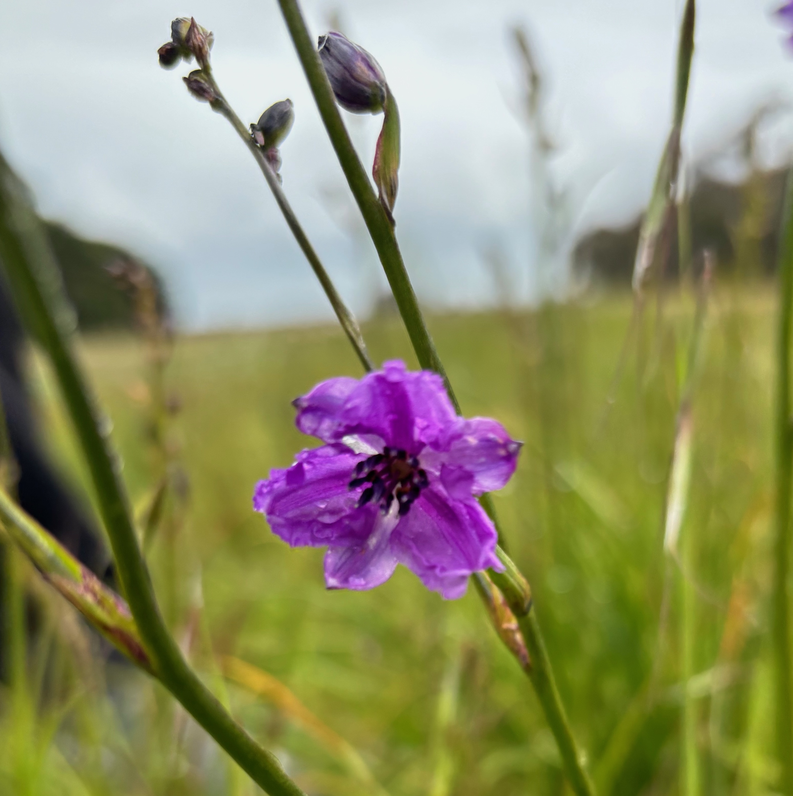
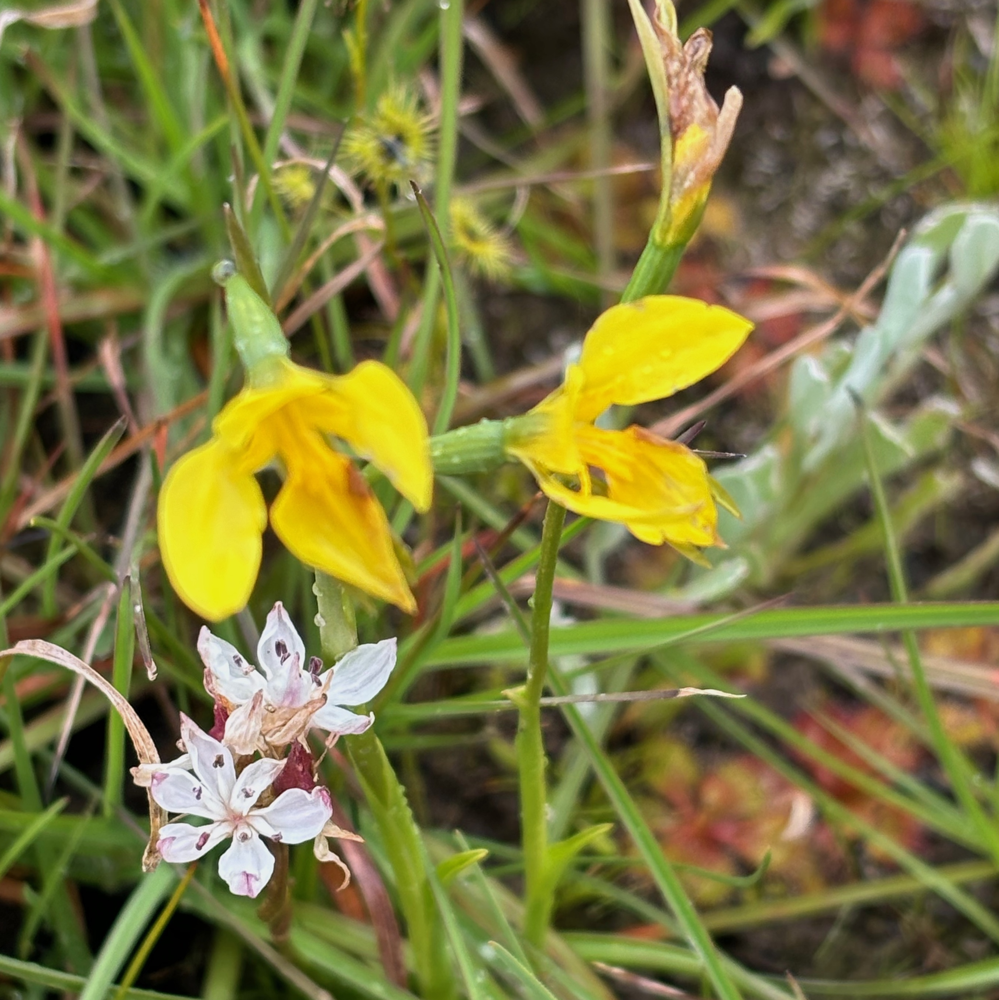
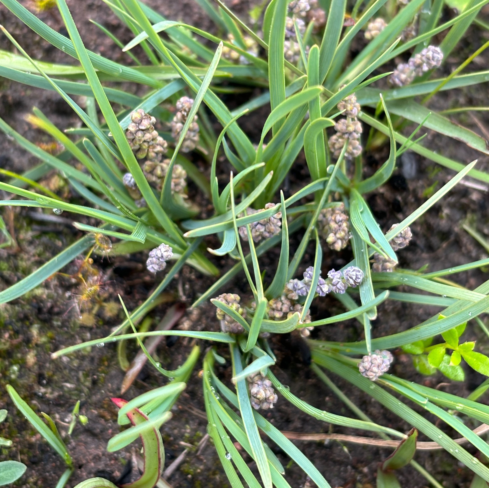
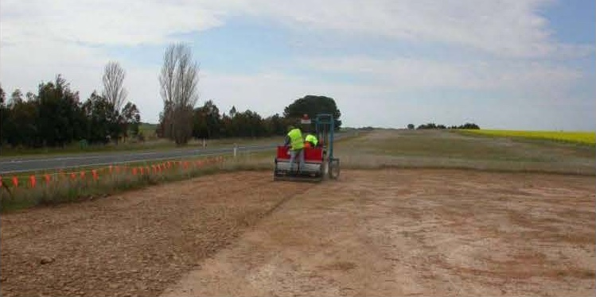

<style>
div.footnotes {
  position: absolute;
  bottom: 0;
  margin-bottom: 10px;
  width: 80%;
  font-size: 0.6em;
  color: #000000;
}
</style>

<script src="https://ajax.googleapis.com/ajax/libs/jquery/3.1.1/jquery.min.js"></script>

<script>
  $(document).ready(function() {
    $('slide:not(.backdrop):not(.title-slide)').append('<div class=\"footnotes\">');
    $('footnote').each(function(index) {
      var text  = $(this).html();
      var fnNum = (index+1).toString().sup();
      $(this).html(text + fnNum);
      var footnote   = fnNum + ': ' + $(this).attr('content') + '<br/>';
      var oldContent = $(this).parents('slide').children('div.footnotes').html();
      var newContent = oldContent + footnote;
      $(this).parents('slide').children('div.footnotes').html(newContent);
    });
  });
</script>


```{r setup, include = FALSE}

knitr::opts_chunk$set(echo = FALSE)

```

---

<div class="centered">

</div>

Native temperate grasslands of south-east Australia<footnote content = "Williams et al. 2015. Land of Sweeping Plains."></footnote>


## Wickliffe & Woorndoo 

<div class="columns-2">




</div>

---

<center>
<div class="columns-2">








</div>
</center>

---

<center>
<div class="columns-2">






</div>
</center>


## Why bother about grasslands?

- There are plenty of "improved" grasslands - fields of wheat, oats, ryegrass, phalaris ...
- Little native grassland remains - 2, 1, 0.5, 0.1 ... % ?
- Native temperate grasslands are among Australia's most endangered plant communities
- High biodiversity
- Support substantial proportion of threatened plants and animals
- Provide ecosystem services
  - store carbon
  - support pollinators
  - reduce salinity, soil acidity and erosion
  
  
## How can we conserve them?

- Best remnants are in cemeteries, road and railway reserves, travelling stock routes
- In Victoria, many 2- and 3-chain roads with the best remnants are old travelling stock routes
- Degradation continues so conserving these plant communities means constructing them
- In Australia, Victoria leads the way in this
- How? From scratch:
  - find a road reserve
  - make sure you've got enough seed for the project
  - scalp the top 100 mm of soil off to remove the weed seed bank and nutrient load
  - direct sow a mix of grass and forbs


## How can we conserve them? {.flexbox .vcenter}

<div class="centered">

</div>

## How can we conserve them? {.flexbox .vcenter}


Unrestricted tussock growth smothers forbs<footnote content = "Williams et al. 2015. Land of Sweeping Plains."></footnote>


## How can we conserve them? {.flexbox .vcenter}


Regular burning allows forbs to survive<footnote content = "Williams et al. 2015. Land of Sweeping Plains."></footnote>

---


<div class="centered">

</div>


